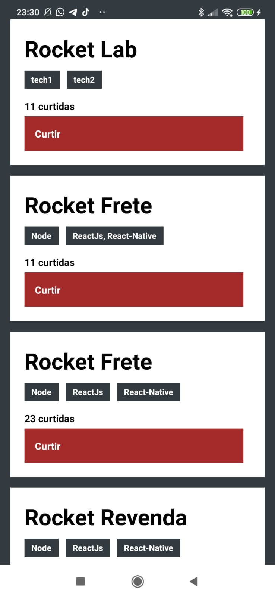

#Desafio 04: Conceitos do React Native


## Funcionalidades da aplicação

- Listar os repositórios da sua API: Deve ser capaz de criar uma lista de todos os repositórios que estão cadastrados na sua API com os campos title, techs e número de curtidas seguindo o padrão ${repository.likes} curtidas, apenas alterando o número para ser dinâmico.

- Curtir um repositório listado da API: Deve ser capaz de curtir um item na sua API através de um botão com o texto Curtir e deve atualizar o número de likes na listagem no mobile.

## Instalação

```bash
  yarn install
```

## Visualização

<p align="center">
  
</p>

### Específicação dos testes

```bash
  yarn test
```
**`should add a like to the like counter of the repository`**: Para que esse teste passe, sua aplicação deve permitir ao clicar no botão Curtir, um like seja adicionado ao repositório listado, e que essa atualização possa ser visualizada na tela.
